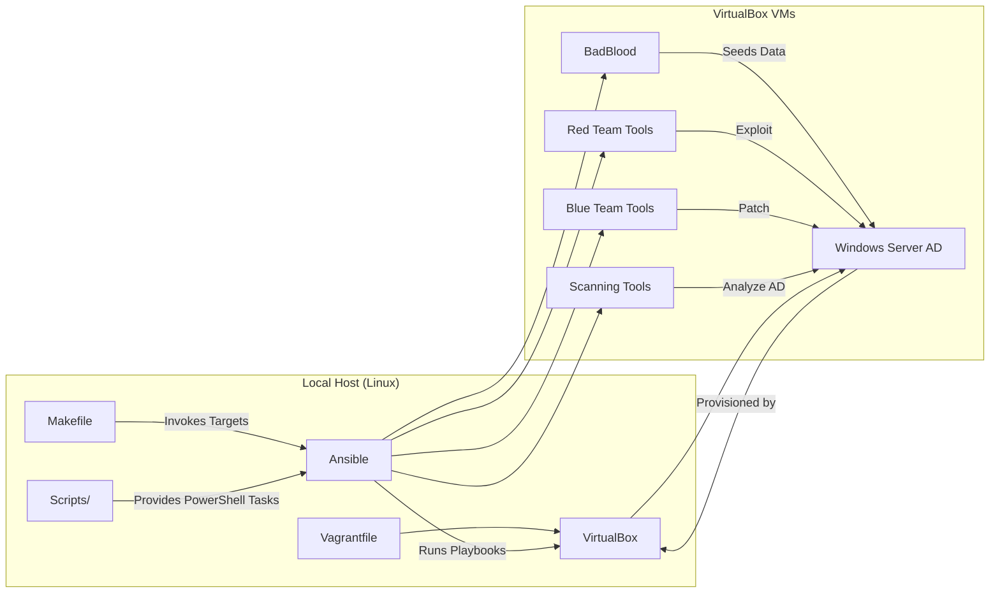

# Description

Playground for Blue Team / Red Team exercises on Active Directory. Designed to be automatically deployed and easily extensible with custom scenarios.


# Architecture



# Requirements

* Linux
* Ansible
* Vagrant
* VirtualBox

# Installation

```bash
git clone https://github.com/MikeHorn-git/ADSecOps.git
cd ADSecOps/
```

## Arch Linux

```bash
chmod +x ./requirements/Arch.sh
./requirements/Arch.sh
make setup
```

## Debian

```bash
chmod +x ./requirements/Debian.sh
./requirements/Debian.sh
make setup
```

# Usage

```bash
Usage: make <target>

Targets:
  setup         Deploy Vagrant and run BadBlood playbook
  deploy        Install requirements
  red           Deploy Red Team playbooks
  blue          Deploy Blue Team playbooks
  scans         Deploy scanning playbooks
  all           Deploy all playbooks
  report        Create a report in PDF format
  clean         Destroy Vagrant VMs
  prune         Prune invalid entries
  distclean     Execute clean and prune commands
```

# Scenarios

## Red Team Playbooks

* `vuln_adcs_template_control`
* `vuln_kerberos_properties_preauth_priv`
* `vuln_permissions_gpo_priv`

## Blue Team Playbooks

* `patch_kerberos_properties_preauth_priv`
* `patch_permissions_gpo_priv`

## Scanning Playbooks

* `adrecon`
* `pingcastle`

## Provisioning

* `badblood`
* `inventory`

# Create Your Own Scenarios

* **Create Your PowerShell Script**

   * Write your PowerShell script and save it in the appropriate `scripts/` directory.

* **Create an Ansible Playbook**

   *rite an Ansible playbook that:
     * Waits for the script to be available on the target machine.
     * Executes the PowerShell script using `win_shell` or `win_command`.

* **Add the Script to Your Repository**

   * Place the PowerShell script in the correct path within the repository (e.g., `scripts/red/`).

* **Run the Playbook**

   * Use the Makefile to deploy the script (e.g., `red`):

     ```bash
     make red
     ```

# Known Issues

## WinRM Command Error

```bash
An error occurred executing a remote WinRM command.

Shell: Cmd
Command: hostname
Message: Digest initialization failed: initialization error
```

**Solution:**
Enable legacy cipher in OpenSSL:

```bash
export OPENSSL_CONF=./.openssl-legacy.cnf
```
